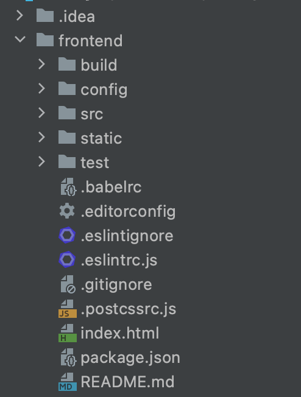

# 使用 CLI 搭建 Vue.js 项目

## 前言

- 前后端分离：核心思想是前端页面通过 ajax 调用后端的 restful api 进行数据交互
    - 单体——> 前端应用 + 后端应用 
    - 前端应用：负责数据展示和用户交互
    - 后端应用：负责提供数据处理接口
    - 前端HTML——>Ajax——>RestFul后端数据接口
    
    

    

- 单页面应用:(single page web application，SPA)，就是只有一张页面，并在用户与应用程序交互时动态更新该页面的 Web 应用程序。

## 一. 安装Vue-CLI

## 二. 构建前端项目

### 2.1 通用方法

### 2.2 使用IDEA


## 三 Vue项目结构

### 1 概览



### 2.index.html
首页初始代码如下：
```html
<!DOCTYPE html>
<html>
  <head>
    <meta charset="utf-8">
    <meta name="viewport" content="width=device-width,initial-scale=1.0">
    <title>frontend</title>
  </head>
  <body>
    <div id="app"></div>
    <!-- built files will be auto injected -->
  </body>
</html>
```
- <div id="app"></div> ，下面有一行注释，构建的文件将会被自动注入，也就是说我们编写的其它的内容都将在这个 div 中展示。
- 整个项目只有这一个 html 文件，所以这是一个 单页面应用，当我们打开这个应用，表面上可以有很多页面，实际上它们都只不过在一个 div 中。

### 3.App.vue
- 将文件称为“根组件”，因为其它的组件又都包含在这个组件中。.vue 文件是一种自定义文件类型，在结构上类似 html，一个 .vue 文件即是一个 vue 组件。
  
- 初始代码如下：
```html
<template>
  <div id="app">
    
    <router-view/>
  </div>
</template>

<script>
export default {
  name: 'App'
}
</script>

<style>
#app {
  font-family: 'Avenir', Helvetica, Arial, sans-serif;
  -webkit-font-smoothing: antialiased;
  -moz-osx-font-smoothing: grayscale;
  text-align: center;
  color: #2c3e50;
  margin-top: 60px;
}
</style>
```
- ```<script>``` 标签里的内容即该组件的脚本，也就是 js 代码，export default 是 ES6 的语法，意思是将这个组件整体导出，之后就可以使用 import 导入组件了。大括号里的内容是这个组件的相关属性。

- ```html<router-view/>```，是一个容器，名字叫“路由视图”，意思是当前路由（ URL）指向的内容将显示在这个容器中。也就是说，其它的组件即使拥有自己的路由（URL，需要在 router 文件夹的 index.js 文件里定义），也只不过表面上是一个单独的页面，实际上只是在根组件 App.vue 中。

### 4 main.js

```js
import Vue from 'vue'
import App from './App'
import router from './router'

Vue.config.productionTip = false

/* eslint-disable no-new */
new Vue({
  el: '#app',
  router,
  components: { App },
  template: '<App/>'
})
```
- 最上面 import 了几个模块:
  - vue 模块在 node_modules 中
  - App 即 App.vue 里定义的组件 
  - router 即 router 文件夹里定义的路由。
- Vue.config.productionTip = false ,作用是阻止vue 在启动时生成生产提示。

- 在这个 js 文件中，我们创建了一个 Vue 对象（实例），el 属性提供一个在页面上已存在的 DOM 元素作为 Vue 对象的挂载目标，router 代表该对象包含 Vue Router，并使用项目中定义的路由。components 表示该对象包含的 Vue 组件，template 是用一个字符串模板作为 Vue 实例的标识使用，类似于定义一个 html 标签。

## 四 Error
- [Mac(m1)下npm install报错解决方案](https://www.cnblogs.com/eisenshu/p/15753955.html)

****


# Vue + Spring Boot 项目实战（三）：前后端结合测试（登录页面开发）

## 前言

## 一. 后端项目创建

## 二. 登录页面开发

### 1 前后端结合
- 前面提到过前后端分离的意思是前后端之间通过 RESTful API 传递 JSON 数据进行交流。不同于 JSP 之类，后端是不涉及页面本身的内容的。

- 在开发的时候，前端用前端的服务器（Nginx），后端用后端的服务器（Tomcat），当我开发前端内容的时候，可以把前端的请求通过前端服务器转发给后端（称为反向代理），这样就能实时观察结果，并且不需要知道后端怎么实现，而只需要知道接口提供的功能，两边的开发人员（两个我）就可以各司其职啦。

### 2 正向代理与反向代理

#### 正向代理


- 正向代理:是一个位于客户端和原始服务器(origin server)之间的服务器，为了从原始服务器取得内容，客户端向代理发送一个请求并指定目标(原始服务器)，然后代理向原始服务器转交请求并将获得的内容返回给客户端。客户端必须要进行一些特别的设置才能使用正向代理。

- 正向代理的用途：
  - 1. 访问原来无法访问的资源，如google
  - 2. 可以做缓存，加速访问资源
  - 3. 户端访问授权，上网进行认证
  - 4. 可以记录用户访问记录（上网行为管理），对外隐藏用户信息

#### 反向代理

- 初次接触方向代理的感觉是，客户端是无感知代理的存在的，反向代理对外都是透明的，访问者者并不知道自己访问的是一个代理。因为客户端不需要任何配置就可以访问。

- 反向代理（Reverse Proxy）实际运行方式是指以代理服务器来接受internet上的连接请求，然后将请求转发给内部网络上的服务器，并将从服务器上得到的结果返回给internet上请求连接的客户端，此时代理服务器对外就表现为一个服务器。

- 反向代理的作用
  - 1. 保证内网的安全，可以使用反向代理提供WAF功能，阻止web攻击
       

  - 2. 负载均衡，通过反向代理服务器来优化网站的负载
       

#### 二者区别

实际上proxy在两种代理中做的事都是代为收发请求和响应，不过从结构上来看正好左右互换了下，所以把后出现的那种代理方式叫成了反向代理。

- 正向代理中，proxy和client同属一个LAN，对server透明；

- 反向代理中，proxy和server同属一个LAN，对client透明。


### 3 前端界面开发

- 创建Login.vue
- components/home/Appindex.vue
- 设置反向代理
```vue
// 设置反向代理，前端请求默认发送到 http://localhost:8443/api
var axios = require('axios')
axios.defaults.baseURL = 'http://localhost:8443/api'
// 全局注册，之后可在其他组件中通过 this.$axios 发送数据
Vue.prototype.$axios = axios
Vue.config.productionTip = false
```

- 页面路由配置：修改 ```src\router\index.js``` 

- 在``` config\index.js ```进行跨域配置
```vue
 proxyTable: {
      '/api': {
        target: 'http://localhost:8443',
        changeOrigin: true,
        pathRewrite: {
          '^/api': ''
        }
      }
    }
```

### 4 后端开发

- 新建pojo包，创建User类
- 新建result包，创建Result类
- 新建controller包，创建loginController类
- ```application.properties```文件配置端口，即加上```server.port=8443```


# Vue + Spring Boot 项目实战（四）：数据库的引入

## 一.引入数据库
- 安装MySql

- 使用 Navicat 创建数据库与表
```mysql
-- ----------------------------
-- Table structure for user
-- ----------------------------
DROP TABLE IF EXISTS `user`;
CREATE TABLE `user` (
                      `id` int(11) unsigned NOT NULL AUTO_INCREMENT,
                      `username` varchar(255) DEFAULT NULL,
                      `password` varchar(255) DEFAULT NULL,
                      PRIMARY KEY (`id`)
) ENGINE=InnoDB AUTO_INCREMENT=2 DEFAULT CHARSET=utf8;

-- ----------------------------
-- Records of user
-- ----------------------------
INSERT INTO `user` VALUES ('1', 'admin', '123');

```

## 二.使用数据库验证登录

- 修改pom.xml文件

- 配置数据库
```properties
spring.datasource.url=jdbc:mysql://127.0.0.1:3306/library?characterEncoding=UTF-8
spring.datasource.username=root
spring.datasource.password=123456
spring.datasource.driver-class-name=com.mysql.jdbc.Driver
spring.jpa.hibernate.ddl-auto = none
```

- 修改User类
 - @Entity 表示这是一个实体类
 - @Table(name=“user”) 表示对应的表名是 user 
   
  - 为了简化对数据库的操作，我们使用了 Java Persistence API（JPA），对于 @JsonIgnoreProperties({ “handler”,“hibernateLazyInitializer” })，解释起来比较复杂，下面的话看不懂可以忽略：
  > 因为是做前后端分离，而前后端数据交互用的是 json 格式。 那么 User 对象就会被转换为 json 数据。 
  > 而本项目使用 jpa 来做实体类的持久化，jpa 默认会使用 hibernate, 在 jpa 工作过程中，就会创造代理类来继承 User ，
  > 并添加 handler 和 hibernateLazyInitializer 这两个无须 json 化的属性，所以这里需要用 JsonIgnoreProperties 
  > 把这两个属性忽略掉。

- 创建UserDAO 
  - Data Access Object（数据访问对象，DAO）即用来操作数据库的对象， 这个对象可以是我们自己开发的，也可以是框架提供的。这里我们通过继承 JpaRepository 的方式构建 DAO
  
- 创建UserService
  - 新建```package```，命名为```service```，新建 ```Java Class```，命名为 ```UserService```
  
  这里实际上是对 UserDAO 进行了二次封装，一般来讲，我们在 DAO 中只定义基础的增删改查操作，
  而具体的操作，需要由 Service 来完成。当然，由于我们做的操作原本就比较简单，
  所以这里看起来只是简单地重命名了一下，比如把 “通过用户名及密码查询并获得对象” 这种方法命名为 get。

- 修改LoginController

```java
User user = userService.get(username, requestUser.getPassword());
        if (null == user) {
            return new Result(400);
        } else {
            return new Result(200);
        }
```

### 三. 简单的三层架构（DAO + Service + Controller）

- DAO 用于与数据库的直接交互，定义增删改查等操作
- Service 负责业务逻辑，跟功能相关的代码一般写在这里，编写、调用各种方法对 DAO 取得的数据进行操作 
- Controller 负责数据交互，即接收前端发送的数据，通过调用 Service 获得处理后的数据并返回


# Vue + Spring Boot 项目实战（五）：使用 Element 辅助前端开发

## 一. 安装并引入Element

### 1. 安装element

```bash
npm i element-ui -S
```

### 2. 引入Element
- 完整引入
- 按需引入

修改main.js
```Vue
import ElementUI from 'element-ui'
import 'element-ui/lib/theme-chalk/index.css'

Vue.use(ElementUI)
```


## 二. 优化登录界面

- 使用Form组件

- 添加样式

- 设置背景

- 


# Vue + Spring Boot 项目实战（六）：前端路由与登录拦截器

## 一. 前端路由

- 前端路由

假设在 html 中有这么一段代码：<div id="test">This is a test</div>，如果我们想让页面定位到这个 div 所在的位置，可以加一个超链接 <a herf="#test">Jump to test</a>，这里的 # 被称为“锚点”，点击超链接，可以发现网页的 URL 发生了变化，但页面并不会跳转。

在互联网流量如此庞大的今天，我们需要想办法后端服务器的压力，利用 AJAX，我们可以不重载页面就刷新数据，如果再加上 # 号的特性（即改变 URL 却不请求后端），我们就可以在前端实现页面的整体变化，而不用每次都去请求后端。


- hash模式

为了实现前端路由，我们可以监听 # 号后面内容的变化（hashChange），从而动态改变页面内容。URL 的 # 号后面的地址被称为 hash ，估计是哪个大神拍脑袋想的，不用深究。这种实现方式我们称之为 Hash 模式，是非常典型的前端路由方式。

- history模式

另一种常用的方式被称为 History 模式，这种方式使用了 History API，History API 顾名思义就是针对历史记录的 API ，这种模式的原理是先把页面的状态保存到一个对象（state）里，当页面的 URL 变化时找到对应的对象，从而还原这个页面。其实原本人家这个功能是为了方便浏览器前进后退的，不得不说程序员们的脑洞真大。使用了这种模式，就可以摆脱 # 号实现前端路由。

## 二. 使用History模式

### 使用history模式

    修改```router\index.js```,加入```mode:'history''```

### 前后端整合在一起

- 接下来，我们把前端打包后部署在后端。这不是前后端分离项目推荐的做法，之前我们讲过其实应该把前后端分别部署在不同的服务器中，但实际上仍有不少项目会选择把前后端整合在一起，只使用一个服务器，所以这里我们也提及一下这种方式，但在之后的开发中不会这样部署。

- 前端运行```npm run build```

- 这时在项目的 dist 文件夹下生成了 static 文件夹和 index.html 文件，把这两个文件， 拷贝到我们后端项目的 \src\main\resources\static 文件夹下

- 运行后端项目，访问login页面发现会跳转到错误页面

这里我们回顾一下单页面应用的概念，在我们这个项目中，其实只有 index.html 这一个页面，所有的其它内容都是在这个页面里动态渲染的。当我们直接在后端访问 /login 路径时，服务器会后端并没有这个路径对应的内容，所以返回了 Error Page。

为了获取到我们需要的内容，我们要想办法触发前端路由，即在后端添加处理内容，把 通过这个 URL 渲染出的 index.html 返回到浏览器。

- 后端项目中新建package名为error，新建实现 ErrorPageRegister接口类的ErrorConfig，把默认错误页面设置为```index.html```


## 三. 后端登录拦截

- 注意：后端登录拦截必须将前后端项目整合起来否则没办法使用这种方式。

- 一个简单拦截器的逻辑如下：
  - 1.用户访问 URL，检测是否为登录页面，如果是登录页面则不拦截
  - 2.如果用户访问的不是登录页面，检测用户是否已登录，如果未登录则跳转到登录页面

### 1. LoginController
- 只是添加了```session.setAttribute("user", user);```

### 2.LoginInterceptor

- 新建 package 名为 interceptor，新建类 LoginInterceptor。

- Interceptor 即拦截器，在 Springboot 我们可以直接继承拦截器的接口，然后实现 preHandle 方法。preHandle 方法里的代码会在访问需要拦截的页面时执行。

- 实现原理：判断 session 中是否存在 user 属性，如果存在就放行，如果不存在就跳转到 login 页面。这里使用了一个路径列表（requireAuthPages），可以在里面写下需要拦截的路径。当然我们也可以拦截所有路径，那样就不用写这么多了，但会有逻辑上的问题，就是你访问了 \login 页面，仍然会需要跳转，这样就会引发多次重定向问题。

### 3.WebConfigurer

- 此时拦截器还不会生效，需要对其进行配置，新建 package 名为 config，新建类 MyWebConfigurer

- 通过这个配置类，我们添加了之前写好的拦截器。这里有一句非常重要的语句，即

```java registry.addInterceptor(getLoginIntercepter()).addPathPatterns("/**").excludePathPatterns("/index.html");```

这条语句的作用是对所有路径应用拦截器，除了 /index.html。

> 之前我们在拦截器 LoginInterceptor 中配置的路径，即 index，触发的时机是在拦截器生效之后。也就是说，我们访问一个 URL，会首先通过 Configurer 判断是否需要拦截，如果需要，才会触发拦截器 LoginInterceptor，根据我们自定义的规则进行再次判断。 
> /index 与 /index.html 是不同的，也就是说 /index 会触发拦截器而 /index.html 不会，但根据拦截器 LoginInterceptor 中我们定义的判断条件，以 /index 开头的路径都会被转发，包括 index.html。 
> 因为我们做的是单页面应用，之前通过配置 ErrorPage，实际上访问所有路径都会重定向到 /index.html 。
> 我们直接在浏览器地址栏输入 /index 会触发拦截器，经过拦截器重定向到 /login，然后 /login 再经过 Configurer 的判断，再次触发拦截器，由于不在需要拦截的路径中，所以被放行，页面则重新定向到了 /index.html，
> 如果没有在Configurer 中取消对 /index.html 的拦截，则会再次触发拦截器，再次重定向到 /login，引发页面重定向次数过多告警。

## 四. Vuex与前端登录拦截器

- 前面我们使用了后端拦截器，但这种拦截器只有在将前后端项目整合在一起时才能生效，而前后端分离的项目实际上不推荐这么做，接下来我们尝试用前端实现相似的功能。

> 实现前端登录器，需要在前端判断用户的登录状态。我们可以像之前那样在组件的 data 中设置一个状态标志，但登录状态应该被视为一个全局属性，而不应该只写在某一组件中。
> 所以我们需要引入一个新的工具——Vuex，它是专门为 Vue 开发的状态管理方案，我们可以把需要在各个组件中传递使用的变量、方法定义在这里。之前我一直没有使用它，
> 所以在不同组件传值的问题上十分头疼，要写很多多余的代码来调用不同组件的值，所以推荐大家从一开始就去熟悉这种管理方式。

### 1.引入Vuex
- ```npm install vuex --save```
- 新建文件夹 /src/store/index.js,引入vue与vuex
- 在 index.js 里设置我们需要的状态变量和方法。为了实现登录拦截器，我们需要一个记录用户信息的变量。为了方便日后的扩展（权限认证等），我们使用一个用户对象而不是仅仅使用一个布尔变量。同时，设置一个方法，触发这个方法时可以为我们的用户对象赋值。此处还用到了 localStorage，即本地存储，在项目打开的时候会判断本地存储中是否有 user 这个对象存在，如果存在就取出来并获得 username 的值，否则则把 username 设置为空。这样我们只要不清除缓存，登录的状态就会一直保存。

### 2.修改路由配置

- 为了区分页面，需要修改```src/router/index.js```在需要拦截的路由中加一条元数据，设置一个 requireAuth字段

### 3. 使用钩子函数判断是否拦截

- 钩子函数：某些时机被调用的函数，这里使用```router.beforeEach()```表示在访问每一个路由前调用。
  - 在 src/main.js，添加对store的引用，并修改Vue对象里的内容
  - 写beforeEach函数，其逻辑如下：
    - 判断访问的路径是否需要登录，如果需要则判断 store中有无user信息，如果存在，则方行
    - 否则跳转到登录页面，并存储访问页面的路径(以便在登录后跳转到访问页)

### 4. 修改 Login.vue

- 之前的登录组件中，我们只是判断后端返回的状态码，如果是 200，就重定向到首页。在经过前面的配置后，我们需要修改一下登录逻辑，以最终实现登录拦截。

- 修改后逻辑如下：
  - 点击登录按钮，向后端发送数据 
  - 收到后端返回的成功代码时，触发 store 中的 login() 方法，把 loginForm 对象传递给 store 中的 user 对象
    （*这里只是简单的实现，在后端我们可以通过用户名和密码查询数据库，获得 user 表的完整信息，比如用户昵称、用户级别等，返回前端，并传递给 user 对象，以实现更复杂的功能）
  - 获取登录前页面的路径并跳转，如果该路径不存在，则跳转到首页
  
# Vue + Spring Boot 项目实战（七）：导航栏与图书页面设计

## 一. 导航栏的实现
- 导航栏的需求：
  - 能够在每个页面显示 
  - 美观

### 1. 路由配置

为了实现第一个要求，我们需要把导航栏放在其它页面的父页面中（对 Vue 来说就是父组件），之前我们讲过，App.vue 是所有组件的父组件，但把导航栏放进去不合适，因为我们的登录页面中不应该显示导航栏。

- 在components目录下新建一个组建，命名为Home.vue
- 这里和 App.vue 一样，写入了一个 <router-view/>，也就是子页面（组件）显示的地方
- 建立路由的父子关系。注意我们在一个组件中通过导入引用了其它组件，也可以称之为父子组件，但想要通过 <router-view/> 控制子组件的显示，则需要进行路由的相关配置。
- 打开router/index.js,修改代码如下：
```javascript
import Vue from 'vue'
import Router from 'vue-router'
import Home from '../components/Home'

/* 导入编写好的组件 */
import AppIndex from '../components/home/Appindex'
import Login from '@/components/Login'

Vue.use(Router)

export default new Router({
  mode: 'history',
  routes: [
    {
      path: '/home',
      name: 'Home',
      component: Home,
      // home页面并不需要被访问
      redirect: '/index',
      children: [
        {
          path: '/index',
          name: 'AppIndex',
          component: AppIndex,
          meta: {
            requireAuth: true
          }
        }
      ]
    },
    {
      path: '/Login',
      name: 'Login',
      component: Login
    }
  ]
})
```
注意我们并没有把首页的访问路径设置为 /home/index，仍然可以通过 /index 访问首页，这样配置其实是感受不到 /home 这个路径的存在的。之后再添加新的页面，可以直接在 children 中增添对应的内容。

### 2. 使用NavMenu组件

- 在components文件夹下新建一个 common文件夹，用来用来存储公共的组件， 
- 在上述文件夹新建一个组件 NavMenu.vue
  - 在 <el-menu> 标签中我们开启了 router 模式，启用该模式会在激活导航时以index作为path路由进行跳转
  - 我们通过 v-for 指令，把 navList 数组渲染为一组 <el-menu-item> 元素，也即导航栏的内容。当然我们也可以分开写，这种用法只是显得 six 一些（当需要动态更改列表内容时就很有用了）
  
- 修改 Home.vue
## 二.图书管理页面

- 核心内容
  - 图书展示区域 
  - 分类导航栏 
  - 搜索栏 
  - 页码

### 1.LibraryIndex.vue

- 在 components 中新建文件夹 library，新建组件 LibraryIndex.vue，作为图书页面的根组件

- 配置页面路由，修改router/index.js
  - 导入组件
  - 在router中添加路由
### 2.SideMenu.vue

- 在components/library路径下新建SideMenu.vue
- 在 LibraryIndex.vue 中使用这个组件

### 3.Books.vue

- 在components/Library目录下新建Book.vue
```vue
<template>
  <div>
    <el-row style="height: 840px;">
      <!--<search-bar></search-bar>-->
      <el-tooltip effect="dark" placement="right"
                  v-for="item in books"
                  :key="item.id">
        <p slot="content" style="font-size: 14px;margin-bottom: 6px;">{{item.title}}</p>
        <p slot="content" style="font-size: 13px;margin-bottom: 6px">
          <span>{{item.author}}</span> /
          <span>{{item.date}}</span> /
          <span>{{item.press}}</span>
        </p>
        <p slot="content" style="width: 300px" class="abstract">{{item.abs}}</p>
        <el-card style="width: 135px;margin-bottom: 20px;height: 233px;float: left;margin-right: 15px" class="book"
                 bodyStyle="padding:10px" shadow="hover">
          <div class="cover">
            
          </div>
          <div class="info">
            <div class="title">
              <a href="">{{item.title}}</a>
            </div>
          </div>
          <div class="author">{{item.author}}</div>
        </el-card>
      </el-tooltip>
    </el-row>
    <el-row>
      <el-pagination
        :current-page="1"
        :page-size="10"
        :total="20">
      </el-pagination>
    </el-row>
  </div>
</template>

<script>
  export default {
    name: 'Books',
    data () {
      return {
        books: [
          {
            cover: 'https://i.loli.net/2019/04/10/5cada7e73d601.jpg',
            title: '三体',
            author: '刘慈欣',
            date: '2019-05-05',
            press: '重庆出版社',
            abs: '文化大革命如火如荼进行的同时。军方探寻外星文明的绝秘计划“红岸工程”取得了突破性进展。但在按下发射键的那一刻，历经劫难的叶文洁没有意识到，她彻底改变了人类的命运。地球文明向宇宙发出的第一声啼鸣，以太阳为中心，以光速向宇宙深处飞驰……'
          }
        ]
      }
    }
  }
</script>

<style scoped>
  .cover {
    width: 115px;
    height: 172px;
    margin-bottom: 7px;
    overflow: hidden;
    cursor: pointer;
  }

  img {
    width: 115px;
    height: 172px;
    /*margin: 0 auto;*/
  }

  .title {
    font-size: 14px;
    text-align: left;
  }

  .author {
    color: #333;
    width: 102px;
    font-size: 13px;
    margin-bottom: 6px;
    text-align: left;
  }

  .abstract {
    display: block;
    line-height: 17px;
  }

  a {
    text-decoration: none;
  }

  a:link, a:visited, a:focus {
    color: #3377aa;
  }
</style>
```
- 重点关注内容
  - v-for 指令，之后可以使用动态渲染，这里我们用《三体》的内容作为一个默认值，先查看效果。 
  - el-tooltip Element 提供的组件，用于展示鼠标悬停时的提示信息。参考 https://element.eleme.cn/2.0/#/zh-CN/component/tooltip
  - slot 插槽，及把标签中的内容插到父组件指定的地方，这里我们插入了 el-tooltip 的 content 中。上述文档中亦有描述。
  - 封面图像标签中，我们使用了 :src="item.cover" 这种写法，: 其实是 v-bind: 的缩写，用于绑定把标签的属性与 data 中的值绑定起来。
  - 搜索栏暂不理会
  - 分页使用 el-pagination 组件，目前只是样式。
  
- 最后把 Books 组件放在 LibraryIndex.vue 中，并稍微修改一下样式

# Vue + Spring Boot 项目实战（八）：数据库设计与增删改查

## 一、数据库设计

- 目前需求
  - 展示书籍的信息，包括封面、标题、作者、出版日期、出版社、摘要和分类。
  - 维护分类信息。
  
- 当前表结构


- 创建user表
```sql
DROP TABLE IF EXISTS `user`;
CREATE TABLE `user` (
  `id` int(11) NOT NULL AUTO_INCREMENT,
  `username` char(255) DEFAULT NULL,
  `password` varchar(255) DEFAULT NULL,
  PRIMARY KEY (`id`)
) ENGINE=InnoDB AUTO_INCREMENT=3 DEFAULT CHARSET=utf8;
```

- 创建category表
```mysql
DROP TABLE IF EXISTS `category`;
CREATE TABLE `category` (
  `id` int(11) NOT NULL,
  `name` varchar(255) NOT NULL,
  PRIMARY KEY (`id`)
) ENGINE=InnoDB DEFAULT CHARSET=utf8;
```

- 创建book表
```mysql
DROP TABLE IF EXISTS `book`;
CREATE TABLE `book` (
  `id` int(11) NOT NULL AUTO_INCREMENT,
  `cover` varchar(255) DEFAULT '',
  `title` varchar(255) NOT NULL DEFAULT '',
  `author` varchar(255) DEFAULT '',
  `date` varchar(20) DEFAULT '',
  `press` varchar(255) DEFAULT '',
  `abs` varchar(255) DEFAULT NULL,
  `cid` int(11) DEFAULT NULL,
  PRIMARY KEY (`id`),
  KEY `fk_book_category_on_cid` (`cid`),
  CONSTRAINT `fk_book_category_on_cid` FOREIGN KEY (`cid`) REFERENCES `category` (`id`) ON DELETE SET NULL ON UPDATE CASCADE
) ENGINE=InnoDB AUTO_INCREMENT=102 DEFAULT CHARSET=utf8;
```
## 二、增删改查

- 需求：
  - 查询书籍信息（查）
  - 上传书籍信息（增）
  - 修改书籍信息（改）
  - 删除书籍信息（删）

### 1.pojo

新建两个pojo，分别是Category和Book

## 2.dao 层

[JPA和Mybatis的区别]()

我们需要再添加一个 BookDAO ，一个 CategoryDAO 。

### BookDAO

```java
package com.evan.wj.dao;

import com.evan.wj.pojo.Book;
import com.evan.wj.pojo.Category;
import org.springframework.data.domain.Page;
import org.springframework.data.jpa.repository.JpaRepository;

import java.util.List;

public interface BookDAO extends JpaRepository<Book,Integer> {
    List<Book> findAllByCategory(Category category);
    List<Book> findAllByTitleLikeOrAuthorLike(String keyword1, String keyword2);
}
```
延续之前 JPA 的写法，findAllByCategory() 之所以能实现，是因为在 Book 类中有如下注解
```java
    @ManyToOne
    @JoinColumn(name="cid")
    private Category category;
```
### CategoryDAO
```java
package com.evan.wj.dao;

import org.springframework.data.jpa.repository.JpaRepository;

import com.evan.wj.pojo.Category;

public interface CategoryDAO extends JpaRepository<Category, Integer> {

}
```

###

## 3.Service 层

### CategoryService
- 对查询结果进行排序以及条件判断
### BookService
- 这个 Service 提供了四个功能，分别是查出所有书籍、增加或更新书籍、通过 id 删除书籍和通过分类查出书籍

## 4.Controller层

[RestController和Controller的区别](https://blog.csdn.net/qq_45754346/article/details/124596138)
- 新建LibraryController
```java
    @GetMapping("/api/books")
    @PostMapping("/api/books")
    @PostMapping("/api/delete")
    @GetMapping("/api/categories/{cid}/books")
```

# Vue + Spring Boot 项目实战（九）：核心功能的前端实现

## 前言

## 一、代码部分

### 1.EditForm.vue（新增）

### 2.SearchBar.vue（新增）

### 3.Books.vue（修改）

- Books.vue 是我们图书管理页面的核心组件，主要的修改如下：
  - 添加搜索框 
  - 添加增加、删除按钮
  - 完善分页功能
  - 构造增、删、改、查对应的请求

### 4.LibraryIndex.vue（修改）

修改主要是实现按分类查询。

### 5. SideMenu.vue（修改）

侧边分类导航栏的修改主要是实现了点击分类引发查询事件

### 6. 测试
## 二、要点讲解
### 1.查询功能实现

- 项目中需要应用查询的地方有以下三处：
  - 打开页面，默认查询出所有图书并显示（即页面的初始化） 
  - 点击左侧分类栏，按照分类显示图书 
  - 在搜索栏中输入作者或书名，可以模糊查询出相关书籍

#### 页面初始化-钩子函数

- 钩子函数：就是在某个特定条件下被触发的函数。钩子函数由于一般与生命周期对应，所以也有 “生命周期钩子函数” 这种叫法，有的地方简称 “生命周期函数”，倒也无可厚非。（严格意义上讲钩子函数的范围更广一些）

- mounted 即 “已挂载” ，所谓挂载，就是我们写的 Vue 代码被转换为 HTML 并替换相应的 DOM 这个过程，这个过程完事儿的时候，就会执行 mounted 里面的代码
```vue
    mounted: function () {
      this.loadBooks()
    }
```
loadbooks方法写在methods中
```vue
loadBooks () {
        var _this = this
        this.$axios.get('/books').then(resp => {
          if (resp && resp.status === 200) {
            _this.books = resp.data
          }
        })
      }
```
就是利用 axios 发送了一个 get 请求，在接受到后端返回的成功代码后把 data 里的数据替换为后端返回的数据。利用 data 和 template 里相应元素的双向绑定，实现页面的动态渲染。

- 除了 mounted 之外，也可以使用 created，但把初始化的操作放在 created 里可能会导致渲染变慢，但差别并不是很大（据说在低端 Android 机上能看出来）。

#### 分类显示

- 分类这个功能的前端实现逻辑是，点击左侧导航栏，向后端发送一个带有参数的 get 请求，然后同样是修改 data 里的数据以实现动态渲染。核心方法如下：
```vue
      listByCategory () {
        var _this = this
        var cid = this.$refs.sideMenu.cid
        var url = 'categories/' + cid + '/books'
        this.$axios.get(url).then(resp => {
          if (resp && resp.status === 200) {
            _this.$refs.booksArea.books = resp.data
          }
        })
      }
```

##### 组件之间的通信

- 在 LibraryIndex 组件的方法里，我们需要获取 SideMenu组件的 data，如何实现
  - SideMenu 组件在 LibraryIndex 组件中作为一个 子组件 存在，是 LibraryIndex 组件的一部分。在它的标签中，我们用 ref 属性设置了一个引用名
  ```vue
  <SideMenu @indexSelect="listByCategory" ref="sideMenu"></SideMenu>
  ```
  - 这样，我们就可以通过 _this.refs.sideMenu 来引用侧面导航栏的实例，并获取它的 data 了。
  - @indexSelect="listByCategory"，这个东西为 listByCategory() 方法设置了触发事件。大家熟悉的事件有点击、鼠标移动之类，都有固定的名称，而这个 indexSelect 是我随便起的，为了触发这个事件，在子组件，也即 SideMenu 里有这么个方法：
  ```vue
        handleSelect (key) {
        this.cid = key
        this.$emit('indexSelect')
      }
  ```
  - emit，即触发，在子组件中使用 $emit 方法，即可触发在父组件中定义的事件。而这个 handleSelect 方法，则由 @select 事件触发。
  
- 总结
  - 触发 <el-menu> 组件的 @select 事件，执行 handleSelect 方法 
  - handleSelect 方法触发 indexSelect 事件，并把 key，即 <el-menu-item> 标签的 index 属性的值赋给 data 中定义的属性，即分类码。
  - 父组件收到指令，执行事件对应的方法，即 listByCategory 方法
  - 发送请求，后端执行查询代码，返回数据，再通过 refs 修改 Books组件的 data 以动态渲染页面。
  
- 注意url的构造方式
```vue
var url = 'categories/' + cid + '/books'
```
#### 搜索栏查询

- 在后端增加关键字查询接口
  - BookService.java 中添加search方法
  - libraryController 里面添加searchResult()方法
  
- 前端核心的组件是 SearchBar，核心的方法写在 Books.vue （SearchBar 的父组件）里

### 2.增加、修改、删除

# 报错汇总

## Unable to Start embedded TomCat

- 错误原因：依赖配置错误,注释掉如下错误

```bash
<!-- <dependency>-->
<!-- <groupId>org.apache.tomcat.embed</groupId>-->
<!-- <artifactId>tomcat-embed-jasper</artifactId>-->
<!-- <version>8.5.23</version>-->
<!-- </dependency>-->
<!-- <dependency>-->
<!-- <groupId>org.springframework.boot</groupId>-->
<!-- <artifactId>spring-boot-starter-tomcat</artifactId>-->
<!-- <scope>provided</scope>-->
<!-- </dependency>-->
```

## springBoot中java.math.BigInteger cannot be cast to java.lang.Long错误

- 错误原因：依赖 mysql-connector-java 版本原因删除pom.xml文件中的版本配置
